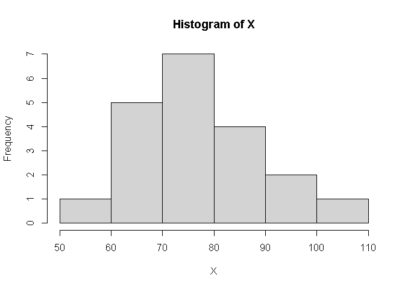
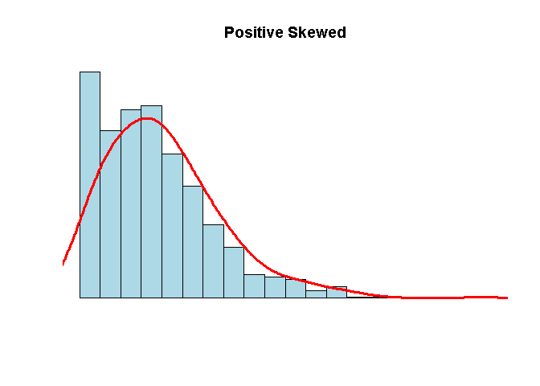
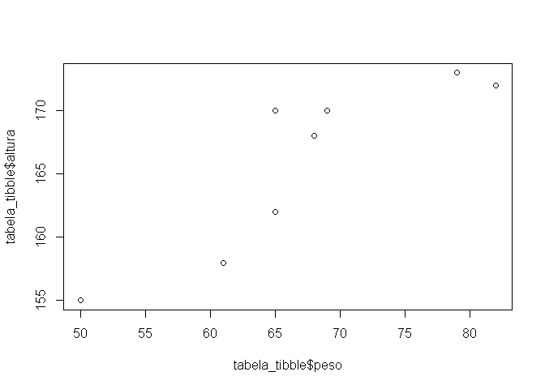

Atividade Avaliativa I
================
jeovane borges
</br> Estat 2021.2

------------------------------------------------------------------------

## **Questao 1**

## *A)* ele errou em usar o valor do quartil superior, sendo que existia mala mais pesadas entre o quadril superior e o limite.

## *B)* 17

## *C)* 13

## *D)* 60

## *Questao 2*

## *A)* Correta

## **Questao 3**

*A)* Rodando o seguinte codigo:

``` r
X <- c(68, 70, 72, 58, 90, 110, 68, 70, 72, 80, 80, 67, 90, 94, 100, 80, 75, 79, 84, 90)
```

|                                                                     |
|---------------------------------------------------------------------|
| *B)*                                                                |
| `r mean(X)`                                                         |
| `## [1] 79.85`                                                      |
| `r quantile(X)`                                                     |
| `##    0%   25%   50%   75%  100% ##  58.0  70.0  79.5  90.0 110.0` |
| `r median(X)`                                                       |
| `## [1] 79.5`                                                       |
| `r sd(X)`                                                           |
| `## [1] 12.78681`                                                   |

Média = 79.85 Primeiro quartil = 70.0 Mediana = 79.5 Terceiro quartil =
90 Desvio padrão = 12.78681 —

**C)** \#

``` r
hist(X
    )
```

<!-- --> A
mediana,pois em um conjunto de valores numéricos é definida como o valor
que ocupa a posição central dos dados ordenados **Questao 4** — *A)*
Rodando o seguinte codigo:

## dados\_corpos &lt;-read\_csv(“dados/brutos/frango\_dieta.csv”)

## dataset está organizado na forma tidy, pois as colunas apresenta variavel.

dados\_corpos %&gt;% glimpse()

|                           |
|---------------------------|
| *B)*                      |
| Rodando o seguinte codigo |

mean(dados\_corpos$peso) média do peso dos fragos é 121.8183

| *C)*                           |
|--------------------------------|
| rodando o seguinte codigo      |
| sd(dados\_corpos$peso)         |
| desvio padrão o valor 71.07196 |

*D)* A variável peso é quantitativa contínua. A variável tempo é
quantitativa discreta A variável frango é qualitativa nominal A variável
dieta é qualitativa nominal — **Questao 5** —

``` r
N <- 1000
x <- rnbinom(N, 4, .5)
hist(
x,
xlim = c(min(x), max(x)),
probability = T,
nclass = max(x) - min(x) + 1,
col = 'lightblue', xlab = ' ', ylab = ' ', axes = F,
main = 'Positive Skewed'
)
lines(density(x, bw = 1), col = 'red', lwd = 3)
```

<!-- --> mediana, pois
é uma medida melhor quando as observações são ordenadas em ordem
crescente — **Questão 06** — *A)* Rodando o seguinte codigo — dados\_co2
&lt;-read\_csv(“dados/brutos/dados\_co2.csv”) —

## dados\_co2 %&gt;% glimpse()

## *B)*

dataset não está organizado na forma tidy, pois as colunas não apresenta
variavel

## *C)* Rodando o seguinte codigo

dados\_co2%&gt;%  
pivot\_longer( !ano,  
names\_to = “mes”,  
values\_to = “ppm”  
)

# 

*D)* Rodando o seguinte codigo salvei na pasta tidy

co2\_tidy &lt;- dados\_co2 %&gt;% pivot\_longer( !ano, names\_to =
“mes”, values\_to = “ppm” ) write\_csv(co2\_tidy,
“dados/tidy/co2\_tidy.csv.”)

|                               |
|-------------------------------|
| *E)*rodando o seguinte codigo |

co2\_tidy %&gt;% group\_by(ano) %&gt;% summarise(media =
round(mean(ppm), 2)) %&gt;% ggplot(aes(ano, media, group = 1)) +
geom\_line(color = “blue”, size = 1) —

## a media da variávelaumentou com o passar dos anos

## **Questao 7**

## **A)**

rodando o codigo

``` r
tabela_tibble <- tribble(
  ~nome,       ~altura, ~peso,
  "Ana",       155,     50,
  "Ludmilla",  158,     61,
  "Cristina",  162,     65,
  "Tereza",    168,     68,
  "Patrícia",  170,     69,
  "Mariana",   170,     65,
  "Ana Paula", 172,     82,
  "Dirce",     173,     79
)
```

|        |
|--------|
| **B)** |

A variável nome é uma variável qualitativa nominal A variável altura é
uma variável quantitativa contínua A variável peso é uma variável
quantitativa contínua —

## **C)**

rodando os codigos

``` r
mean(tabela_tibble$peso)
```

    ## [1] 67.375

``` r
median(tabela_tibble$peso)
```

    ## [1] 66.5

``` r
sd(tabela_tibble$peso)
```

    ## [1] 10.04188

``` r
mean(tabela_tibble$altura)
```

    ## [1] 166

``` r
median(tabela_tibble$altura)
```

    ## [1] 169

``` r
sd(tabela_tibble$altura)
```

    ## [1] 6.78233

|                          |
|--------------------------|
| Altura                   |
| média = 166              |
| mediana = 169            |
| desvio padrão = 6.78233  |
| peso                     |
| média = 67.375           |
| mediana = 66.5           |
| desvio padrão = 10.04188 |

## **D)**

``` r
plot(tabela_tibble$peso, tabela_tibble$altura)
```

<!-- --> a altura e o
Pessoa tem uma relação de quanto maior mais pesado é a pessoa.
